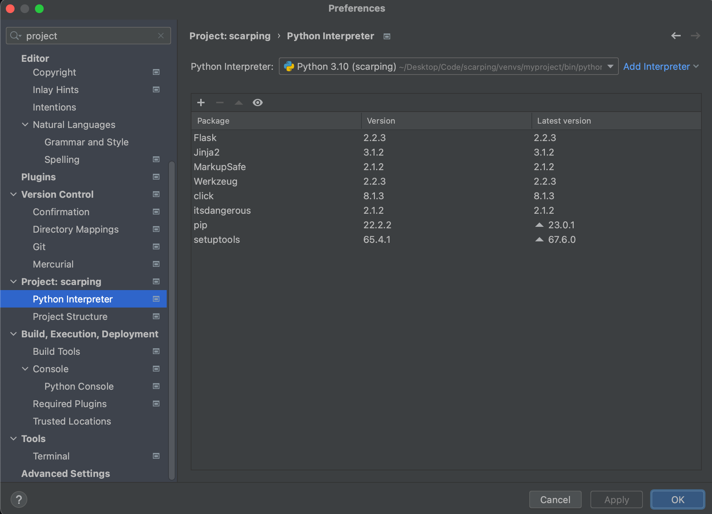

# 파이썬 크롤러 만들기

## 파이썬 가상 환경 사용해 보기

### 가상 환경 만들기

```bash
mkdir venvs
cd venvs
python3 -m venv myproject
```

> 맥(Mac) 사용자는 python대신 python3 명령을 사용해야됨.

### 가상 환경 진입하기

```bash
# venv/myproject/bin 위치의 activate 실행
source activate
```

> 가상환경에서 벗어나려면 deactivate 해주면 됨.

**어떤 파이썬 환경이 실행되는지 확인하기**

```bash
(venv-project) $ which python
```

이제 마음껏 가상환경에 파이썬 패키지를 설치하면 된다

### PyCharm에 가상환경 세팅하기



### 파이썬 패키지 requirements 만드는 법

```bash
# pip freeze 이용하기
$ pip freeze > requirements.txt

# -r 옵션 이용하기
$ pip install -r requirements.txt
```

### 가상환경 위치에서 flask 실행하기

> 가상환경 진입후 -> flask app 실행 파일 위치에서 `flask run` 커맨드

기본적으로 flask 는 `app.py` 를 찾아서 실행하므로 커스텀하고 싶다면 `set FLASK_APP=` 명령어를 사용하여 파일명을 바꿀 수 있음 

개발모드 세팅 `set FLASK_DEBUG=true`


## Scrapy

### scrapy project 시작하기

```bash
scrapy startproject [project name]
```

> 프로젝트를 생성하면 파일 구조는 다음과 같다.

```
[project name]
├── [project name]
│    ├── spiders
│	 │   └── __init__.py
│    ├── items.py
│    ├── middlewares.py
│    ├── pipelines.py
│    ├── settings.py
│    └── __init__.py
├── __init__.py
└── scrapy.cfg
```

- `spiders` : 크롤링할 페이지를 정의하고 
- `items.py` : 크롤링한 데이터를 db 등에 저장하는 기능을 하는 객체의 클래스를 정의하는 파일
- `middlewares.py` : scrapy 에서 다른 모듈로 데이터를 송수신할 때 거치는 미들웨어
- `pipelines.py` : item pipelines의 커스텀 모듈을 정의하는 파일
- `scrapy.cfg` : 프로젝트의 전체적인 설정을 하는 파일
